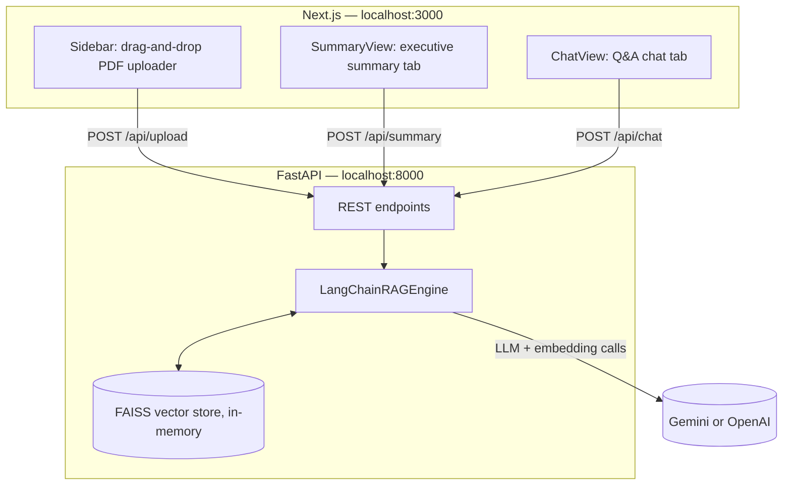

# DocuMind — PDF Intelligence Studio

DocuMind is a Retrieval-Augmented Generation (RAG) application for PDF documents. Upload one or more PDFs and it will index their contents into a vector store, generate a structured executive summary, and answer natural-language questions grounded strictly in the uploaded text — every answer comes with clickable citations back to the exact file and page it was drawn from.

The project is a clean two-service split:

- **`backend/`** — a FastAPI service that does the actual document processing, embedding, retrieval, and LLM calls (via LangChain).
- **`frontend/`** — a Next.js single-page app that gives you a glassmorphism-styled interface to upload documents, read the summary, and chat with them.

No API key is ever entered or stored in the browser. The frontend only talks to your own backend over HTTP; the backend is the only place that reads secrets from `.env`.

---

## Table of contents

1. [How it works](#how-it-works)
2. [Project structure](#project-structure)
3. [Backend — file by file](#backend--file-by-file)
4. [Frontend — file by file](#frontend--file-by-file)
5. [Setup](#setup)
6. [Environment variables](#environment-variables)
7. [API reference](#api-reference)
8. [Design system](#design-system)
9. [Troubleshooting](#troubleshooting)

---

## How it works



Step by step, when you use the app:

1. **Upload** — you drop one or more PDFs into the sidebar. The frontend sends them as `multipart/form-data` to `POST /api/upload`.
2. **Ingest** — the backend loads each PDF page with `PyPDFLoader`, tags every page with its source filename and page number, and splits the text into ~1000-character overlapping chunks with `RecursiveCharacterTextSplitter`.
3. **Embed & index** — each chunk is embedded (Gemini, OpenAI, or a local HuggingFace fallback if the primary embedding call fails) and stored in an in-memory **FAISS** vector index, wrapped as a retriever (`k=4`).
4. **Summarize** — clicking "Generate Summary" sends the first ~30 pages of raw text through a prompt template that returns a structured Markdown report (executive summary, themes, takeaways, terminology, follow-up questions).
5. **Ask** — every chat question is embedded, the 4 most relevant chunks are retrieved from FAISS, and both the question and that retrieved context are passed to the LLM. The model is instructed to answer *only* from that context and say so explicitly if the document doesn't cover it. Each retrieved chunk is returned alongside the answer as a citation (filename, page number, text snippet).
6. **Reset** — clears the backend's in-memory engine and the frontend's local state, so you can start over with a new document.

There is no database and no persistence between backend restarts — the vector store lives in a single global variable in `backend/main.py` for the duration of the process. This keeps the project simple and self-contained; it is not meant for concurrent multi-user sessions.

---

## Project structure

```
RAG Project/
├── backend/
│   ├── main.py            # FastAPI app: routes, request/response models, CORS
│   ├── rag_engine.py       # LangChainRAGEngine: PDF parsing, chunking, FAISS, summary & QA chains
│   ├── utils.py            # Small helpers: token estimation, document stat aggregation
│   ├── requirements.txt    # Backend Python dependencies
│   └── .env                # Backend secrets (gitignored — see Environment variables)
│
├── frontend/
│   ├── app/
│   │   ├── layout.tsx      # Root HTML shell + page metadata
│   │   ├── page.tsx        # Top-level page: owns all app state, wires components to the API
│   │   └── globals.css     # Design tokens, glassmorphism utilities, background, markdown styling
│   ├── components/
│   │   ├── Navbar.tsx       # Brand header + live backend health indicator
│   │   ├── Sidebar.tsx      # Model/provider selection, PDF uploader, document stats
│   │   ├── SummaryView.tsx  # Executive summary tab (generate / regenerate / copy)
│   │   └── ChatView.tsx     # Q&A chat tab with prompt suggestions and citations
│   ├── package.json
│   └── tsconfig.json / next.config.ts / eslint.config.mjs
│
├── .env.example             # Template for backend/.env — copy and fill in your key
├── .gitignore
└── README.md
```

---

## Backend — file by file

### `backend/main.py`

The FastAPI application and its five routes. It holds one module-level variable, `rag_engine_instance`, which is the single source of truth for "what document is currently loaded." There is no per-user session handling — this is intentional for a local, single-operator tool.

| Route | Method | Purpose |
|---|---|---|
| `/api/health` | GET | Reports service status and whether a Gemini/OpenAI key is configured and a document is loaded. Polled by the frontend Navbar every 10s. |
| `/api/upload` | POST | Accepts one or more PDF files plus `provider`/`model_name` query params, builds a fresh `LangChainRAGEngine`, and indexes the documents. |
| `/api/summary` | POST | Runs the executive-summary chain against the currently loaded document. |
| `/api/chat` | POST | Runs the retrieval + answer chain for a single question. |
| `/api/reset` | POST | Drops the in-memory engine, clearing the current session. |

### `backend/rag_engine.py`

The `LangChainRAGEngine` class — all LangChain logic lives here, isolated from the HTTP layer:

- **`_init_llm` / `_init_embeddings`** — construct the chat model and embedding model for the selected provider (`Google Gemini` or `OpenAI`). If the primary embedding provider fails (e.g. quota, bad key), it transparently falls back to a local `sentence-transformers/all-MiniLM-L6-v2` model so the app keeps working offline-capable for embeddings.
- **`process_pdf_bytes`** — writes each uploaded file to a temp path (PyPDFLoader needs a filesystem path), loads it, tags every page with `source_name`/`page_number` metadata, chunks it, and builds the FAISS index.
- **`generate_pdf_summary`** — a single LCEL chain (`prompt | llm | StrOutputParser()`) that returns the five-section Markdown summary.
- **`answer_question`** — retrieves the top-k chunks for a question, formats them with their source/page tags, and runs a second LCEL chain that answers strictly from that context. Returns both the answer text and a `sources` list the frontend renders as citations.

### `backend/utils.py`

Small, stateless helpers used by `main.py`:

- `estimate_tokens` — a rough `len(text) // 4` token estimate (no tokenizer dependency).
- `get_env_api_key` — reads the right `.env` variable for the selected provider.
- `format_doc_stats` — turns the raw page/chunk lists into the counts shown in the Sidebar (pages, chunks, words, estimated tokens).

### `backend/requirements.txt`

FastAPI, Uvicorn, LangChain (core, community, Google GenAI and OpenAI integrations), `pypdf` for PDF parsing, `faiss-cpu` for the vector index, and `python-dotenv` for config loading.

---

## Frontend — file by file

### `app/layout.tsx`

The root HTML document. Sets the page `<title>`/description and applies the base body styling; the actual background gradient and glass tokens live in `globals.css` so this file stays minimal.

### `app/page.tsx`

The only stateful component in the app. It owns:

- Provider/model selection state, passed down to `Sidebar`.
- Upload / summary-generation / chat-sending handlers, each calling the backend with `fetch` and translating failures (including "backend is offline") into a dismissible error banner.
- The active tab (`summary` vs `chat`) and the rendered document stats, summary Markdown, and chat history.

It renders `Navbar`, `Sidebar`, and whichever of `SummaryView` / `ChatView` is active, inside a fixed-width, glass-toned workspace shell.

### `app/globals.css`

The design system in one file:

- CSS custom properties for the accent color and glass tokens.
- A fixed, multi-stop radial-gradient background (warm orange, amber, and a cool slate accent) that the translucent glass panels sit on top of — this is what produces the depth/blur effect.
- Three reusable glass utility classes — `.glass`, `.glass-strong`, `.glass-subtle` — each combining a translucent background, `backdrop-filter: blur(...) saturate(...)`, a soft border, and a diffuse shadow. Every card, header, input, and button surface in the app is one of these three, so the whole UI reads as one consistent material.
- Markdown (`.prose`) overrides so AI-generated summaries and chat answers render with the same high-contrast, on-brand typography as the rest of the UI.

### `components/Navbar.tsx`

Sticky glass header. Polls `GET /api/health` every 10 seconds and shows a live connection dot (checking / connected+provider / offline), plus the session Reset button.

### `components/Sidebar.tsx`

Three stacked sections in a single glass panel:

1. Provider/model dropdowns (Gemini or OpenAI, with model choices per provider).
2. A drag-and-drop (or click-to-browse) PDF dropzone with a selected-files list and a "Process Document" submit button.
3. A 2×2 document-stats grid (pages, chunks, words, estimated tokens) that appears once a document has been processed.

### `components/SummaryView.tsx`

Header banner with a "Generate/Regenerate Summary" action and a "Copy Summary" button, followed by the rendered Markdown summary (via `react-markdown` + `remark-gfm`), a loading state, and an empty state.

### `components/ChatView.tsx`

A self-contained chat panel: message list with user/assistant bubbles, an empty state with clickable prompt suggestions, a collapsible "Citations" accordion per assistant message (file name, page number, and the exact retrieved snippet), a "thinking" indicator, and the message input form.

---

## Setup

### Prerequisites

- Python 3.10+
- Node.js 18+ and npm
- A Google Gemini API key ([Google AI Studio](https://aistudio.google.com/), free tier available) and/or an OpenAI API key

### 1. Backend

```bash
cd backend
pip install -r requirements.txt
cp ../.env.example .env      # then edit .env and paste your real key(s)
python -m uvicorn main:app --reload --port 8000
```

The API is now live at `http://localhost:8000` (interactive docs at `http://localhost:8000/docs`).

### 2. Frontend

In a second terminal:

```bash
cd frontend
npm install
npm run dev
```

Open `http://localhost:3000`. The Navbar's connection indicator confirms the backend is reachable and which provider key it found.

---

## Environment variables

### Backend (`backend/.env`, gitignored — never commit real keys)

`.env.example` at the repo root documents the shape:

| Variable | Required | Description |
|---|---|---|
| `GEMINI_API_KEY` | Yes, unless using OpenAI | Google Gemini API key, used for both the chat model and embeddings. |
| `OPENAI_API_KEY` | Yes, unless using Gemini | OpenAI API key, used as an alternative provider. |
| `DEFAULT_PROVIDER` | No | `Google Gemini` or `OpenAI` — informational default; the actual provider used per-request is whatever the frontend sends. |

### Frontend (`frontend/.env.local`, gitignored — `frontend/.env.example` documents it)

| Variable | Required | Description |
|---|---|---|
| `NEXT_PUBLIC_BACKEND_URL` | No (defaults to `http://localhost:8000`) | Base URL of the FastAPI backend, no trailing slash. Must be set to your Render URL in production. |

This is a **build-time** variable — Next.js inlines `NEXT_PUBLIC_*` values into the client bundle when it builds, so changing it in Vercel requires a new deployment (redeploy, don't just save).

---

## Deploying (Vercel + Render)

### Render — backend

1. New **Web Service** → point it at this repo, set **Root Directory** to `backend`.
2. Build command: `pip install -r requirements.txt`
3. Start command: `uvicorn main:app --host 0.0.0.0 --port $PORT`
   (`backend/main.py` also reads `$PORT` itself if Render ever invokes `python main.py` directly, but the explicit start command above is the standard Render setup.)
4. Add environment variables `GEMINI_API_KEY` / `OPENAI_API_KEY` (same values as your local `backend/.env`).
5. Deploy, then note the public URL Render gives you, e.g. `https://your-service.onrender.com`.

Render's free tier spins the service down after inactivity — the first request after idling can take 30–60s to respond while it cold-starts. That's expected, not a bug; the Navbar will show "Connecting…" until it answers.

### Vercel — frontend

1. Import this repo, set **Root Directory** to `frontend`.
2. Add an environment variable: `NEXT_PUBLIC_BACKEND_URL` = your Render URL from above (no trailing slash).
3. Deploy. If you add/change this variable after the first deploy, trigger a **redeploy** — it won't take effect on the existing build.

### Why "frontend can't reach backend" happens

`frontend/app/page.tsx` resolves the API base as `process.env.NEXT_PUBLIC_BACKEND_URL || "http://localhost:8000"`. If that env var isn't set in Vercel's project settings (or was set but the project wasn't redeployed afterwards), the deployed frontend is still hardcoded to `localhost:8000` — which doesn't exist from a visitor's browser — so every request fails and the Navbar shows "Backend Offline." Setting the variable and redeploying is the fix.

CORS is already permissive (`allow_origins=["*"]` in `backend/main.py`), so no additional CORS configuration is needed for the Vercel domain to reach the Render backend.

---

## API reference

| Method | Endpoint | Body / params | Response |
|---|---|---|---|
| `GET` | `/api/health` | — | `{ status, gemini_api_configured, openai_api_configured, is_document_loaded }` |
| `POST` | `/api/upload` | `files: File[]` (multipart), `provider`, `model_name` (query params) | `{ message, stats, filename_list }` |
| `POST` | `/api/summary` | — (operates on the currently loaded document) | `{ summary_markdown }` |
| `POST` | `/api/chat` | `{ question, provider?, model_name? }` (JSON) | `{ answer, sources: [{ file_name, page_number, snippet }] }` |
| `POST` | `/api/reset` | — | `{ message }` |

All endpoints return a `4xx`/`5xx` with a `detail` message on failure (no document loaded, empty question, PDF parsing error, etc.), which the frontend surfaces directly in its error banner.

---

## Design system

The UI uses a **glassmorphism** treatment: every surface is a translucent, blurred panel (`.glass` / `.glass-strong` / `.glass-subtle` in `globals.css`) floating over a fixed warm gradient background, rather than flat opaque cards. This is deliberately restrained — one accent color (orange), one glass recipe reused everywhere, minimal copy, and no decorative clutter — so the interface stays legible and professional rather than purely decorative.

To restyle the app (e.g. a different accent color), the only file that needs to change is `frontend/app/globals.css`: update the `--accent*` custom properties and the gradient stops, and every component picks up the change automatically since they all consume the shared `.glass` classes.

---

## Troubleshooting

**"Backend Offline" in the Navbar** — the FastAPI server on port 8000 isn't running, or crashed on startup (check that terminal for a missing/invalid API key error).

**Upload succeeds but summary/chat fails** — usually an invalid or quota-exceeded API key. Check the FastAPI terminal output for the underlying LangChain/provider error, which is passed through in the response `detail`.

**Embeddings fall back to HuggingFace unexpectedly** — this is by design: if the Gemini/OpenAI embedding call fails for any reason, `rag_engine.py` retries with a local `sentence-transformers` model so the app degrades gracefully instead of failing outright. Check your embedding API quota if you expect the primary provider to be used.

**CORS errors in the browser console** — confirm the backend is running on port 8000; `main.py` currently allows all origins (`allow_origins=["*"]`), so this should only happen if the backend isn't reachable at all.

---

## License

No license file is included yet — add one (e.g. MIT) before distributing this project publicly.
